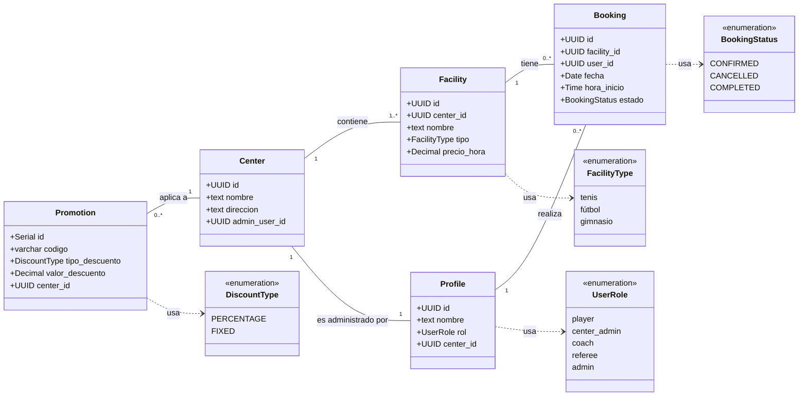

# SportHub – Sistema Web de Gestión de Centros Deportivos y Reservas

**Fecha:** 30/10/2025  
**Equipo:** Javier · Rares · Pablo · Mario

## 1. Resumen Ejecutivo

SportHub es una plataforma web para la reserva y gestión de instalaciones deportivas. Esta edición, orientada a cliente y al ámbito académico, elimina cualquier integración de pagos y correo SMTP. La autenticación y gestión de identidad se realiza con Auth0 (OIDC), mientras que los datos, tiempo real y almacenamiento se gestionan con Supabase (PostgreSQL, Realtime, Storage, Edge Functions).

El objetivo del MVP es ofrecer una experiencia fluida para jugadores y administradores de centro: descubrir centros, consultar disponibilidad sin choques de horario, reservar/cancelar dentro de política y administrar la operativa del centro — todo con seguridad por roles y actualizaciones en tiempo real in‑app.

## 2. Alcance

### Incluido (MVP):

* Gestión de usuarios y perfiles por rol (player, center_admin, coach, referee, admin).
* Centros e instalaciones: catálogo, horarios base y bloqueos puntuales.
* Disponibilidad y reservas con prevención de doble reserva a nivel de BBDD.
* Panel de administración de centro y backoffice global.
* Notificaciones in‑app (Realtime)
* Soporte multilenguaje (ES/EN) y diseño responsive.

### Fuera de alcance (podrá considerarse más adelante):

* Cobros online y reembolsos (ningún proveedor activado en esta versión).
* Envío de correos (SMTP/servicios de e‑mail).
* Sincronización con calendarios externos y wearables.

## 3. Detalle Funcional y Técnico

### Especificación Técnica – Sistema Web de Gestión de Centros Deportivos y Reservas

#### Introducción y Alcance del Proyecto

Este documento describe la arquitectura y el diseño técnico de una aplicación web para gestión de centros deportivos y reserva de actividades. El sistema permitirá gestionar usuarios (jugadores, administradores de centros deportivos, entrenadores, árbitros), espacios deportivos (instalaciones y canchas), horarios y reservas en tiempo real, pagos en línea, cancelaciones, historial de reservas y notificaciones. También se incluyen un panel de administración para los centros deportivos y un backoffice general para estadísticas, promociones y gestión de personal. El sistema soportará multilenguaje para ofrecer la interfaz en varios idiomas.

**Fuera de alcance (próximas fases):** Integración con wearables, sincronización con calendarios externos (Google Calendar, etc.) o sistemas avanzados de matchmaking entre jugadores. No se implementarán en la primera versión, pero la arquitectura se diseña pensando en facilitar estas ampliaciones en el futuro.

**Tecnologías principales:** Frontend en React (JavaScript/TypeScript) para una SPA responsiva; Backend en Node.js con Express para exponer una API REST segura; Base de datos PostgreSQL gestionada a través de Supabase, que provee autentificación, almacenamiento de archivos, funciones serverless (Edge Functions) y capacidades realtime. Se optó por Supabase por ser una plataforma abierta y escalable que incluye los servicios esenciales (BBDD relacional, auth JWT, storage, WebSockets, etc.) de forma integrada, acelerando el desarrollo.

#### Diagrama de clases



#### Arquitectura General del Sistema

La solución seguirá una arquitectura de cliente-servidor tradicional, con separación clara de responsabilidades:

**Aplicación Frontend (React):** Aplicación de página única (SPA) que se ejecuta en el navegador del usuario. Gestiona la interfaz de usuario, interacciones y lógica de presentación. Consume la API REST del backend para las operaciones (reservas, pagos, etc.) y puede conectarse directamente a algunos servicios de Supabase (p. ej. suscripción realtime a cambios de la base de datos). La app almacena un token de sesión (JWT) tras la autenticación y lo usa en las peticiones al servidor.

**Base de Datos (PostgreSQL via Supabase):** Almacena de forma centralizada todos los datos de la aplicación: usuarios, instalaciones, reservas, pagos, etc. Supabase proporciona un Postgres gestionado con Row Level Security (RLS) para control de acceso a nivel de fila, lo que permite garantizar que cada usuario solo acceda a los datos que le corresponden. También se utilizarán foreign keys y constraints en la base de datos para asegurar la integridad referencial.

**Administración y Backoffice:** La aplicación distinguirá entre diferentes roles de usuario. Los administradores de centro deportivo tendrán acceso a una sección de administración propia dentro de la app donde pueden ver y gestionar sus instalaciones, horarios, reservas y personal. Adicionalmente, habrá un rol de administrador global (backoffice) con permisos para ver estadísticas globales, crear promociones en toda la plataforma y gestionar usuarios de todos los tipos.

**Escalabilidad:** Esta arquitectura soporta crecimiento: se pueden escalar horizontalmente los servidores Node sin estado y Supabase puede escalar la base de datos verticalmente y mediante réplicas de solo lectura si aumenta la carga.

### Frontend – Aplicación React

El frontend será una Single Page Application construida con React (posiblemente usando Vite para inicializar el proyecto, por su rapidez). Se prioriza una arquitectura de componentes reutilizables, un manejo claro del estado de la aplicación y una organización que facilite escalar la base de código.

#### Librería UI y Estilos

Se propone utilizar **Tailwind CSS** como framework de estilos por su enfoque de utilidad que acelera el desarrollo y asegura consistencia en diseños responsivos. Alternativamente, se valoró Material UI (MUI) por sus componentes preconstruidos de alta calidad, pero se optó por Tailwind para mayor flexibilidad de diseño y rendimiento.

#### Estructura de Carpetas del Proyecto

```
src/
├── pages/          # Componentes de página para cada ruta principal
├── components/     # Componentes reutilizables y genéricos
├── context/        # Definición de contextos de React para estado global
├── hooks/          # Hooks personalizados que abstraen lógica común
├── utils/          # Utilidades y helpers puros
├── assets/         # Recursos estáticos
├── styles/         # Configuración global de estilos
└── types/          # Interfaces TypeScript (si se usa)
```

#### Rutas y Navegación

Se usará **React Router** para definir la SPA routing:

**Rutas Públicas (no requieren login):**
- `/login`, `/register` (acceso y registro de usuarios)
- Páginas informativas como inicio público o ayuda

**Rutas Privadas (requieren autenticación):**

**Jugador estándar:**
- `/centros` → `/centros/:id` → proceso de reserva
- `/mis-reservas` (calendario personal de reservas)

**Admin de Centro:**
- `/admin-centro/*` (dashboard, CRUD de instalaciones, gestión de horarios, lista de reservas, gestión de entrenadores/árbitros)

**Backoffice Admin Global:**
- `/admin/*` (panel general, gestión de promociones globales, gestión de usuarios, gestión de personal global)

#### Gestión de Estado

Se usará principalmente el estado local de React y Context API para estados globales sencillos. Para datos remotos, se recomienda usar **React Query** o **SWR** para evitar re-fetching manual y manejo de caché.

#### Multilenguaje (Internacionalización)

Se implementará soporte multiidioma usando la librería **react-i18next**. Se incluirá al menos español e inglés desde el lanzamiento.

#### Componentes Específicos

* **Calendario/Picker de horarios:** Para mostrar slots horarios disponibles en tiempo real
* **Formulario de reserva:** Para confirmar reservas y aplicar códigos promocionales
* **Notificaciones al usuario:** Toast notifications y/o API de notificaciones del navegador

### Backend – API Node.js con Express

El backend será una aplicación Node.js usando el framework Express para estructurar una API RESTful clara y mantenible.

#### Estructura de Proyecto

```
/
├── routes/         # Definiciones de endpoints por módulo
├── controllers/    # Funciones controladoras que manejan la lógica de cada endpoint
├── services/       # Lógica de negocio y acceso a datos (Supabase)
├── middlewares/    # Middleware reutilizable (auth, validación, logging, etc.)
└── index.js        # Archivo principal del servidor
```

#### Integración con Supabase

Se utilizará la biblioteca oficial `@supabase/supabase-js` para interactuar con la base de datos y servicios Supabase. Se creará un cliente supabase usando la URL y la API Key de servicio desde variables de entorno.

#### Endpoints Principales

**Auth:** Endpoints de registro/login que usen Auth0 (opcional, puede delegarse al cliente)

**Usuarios:**
- `GET /usuarios/me` - Obtener mi perfil
- `PUT /usuarios/me` - Editar datos personales

**Centros deportivos:**
- `GET /centros` - Lista todos los centros
- `GET /centros/:id` - Detalle de un centro
- `POST /centros` - Crear nuevo centro (solo admins)
- `PUT /centros/:id` - Editar información

**Instalaciones:**
- `GET /centros/:id/instalaciones` - Lista instalaciones de un centro
- `POST /centros/:id/instalaciones` - Crear nueva instalación
- `PUT /instalaciones/:id` - Editar instalación
- `DELETE /instalaciones/:id` - Eliminar instalación

**Disponibilidad:**
- `GET /instalaciones/:id/disponibilidad?fecha=YYYY-MM-DD` - Slots horarios disponibles

**Reservas:**
- `POST /reservas` - Crear nueva reserva
- `GET /reservas?usuarioId=...` - Reservas por usuario
- `GET /reservas?centroId=...` - Reservas por centro
- `DELETE /reservas/:id` - Cancelar reserva

**Administración Centro:**
- `GET /admin-centro/resumen` - Dashboard con estadísticas
- `GET /admin-centro/reservas` - Todas las reservas del centro
- `POST /admin-centro/entrenadores` - Invitar entrenador

**Backoffice Admin:**
- `GET /admin/estadisticas` - Métricas globales
- `POST /admin/promociones` - Crear promoción global
- `GET /admin/usuarios` - Gestión de usuarios
- `PUT /admin/usuarios/:id` - Cambiar rol de usuario

#### Lógica de Negocio y Reglas Clave

* **Evitar dobles reservas:** Verificación en BD + constraint único en tabla de reservas
* **Política de cancelación:** No permitir cancelaciones el mismo día
* **Gestión de roles y permisos:** Checks de autorización en endpoints + RLS

#### Row Level Security (RLS) en Supabase

Se habilitará RLS en las tablas sensibles:

```sql
-- Ejemplo: Tabla bookings
CREATE POLICY "Players can view own bookings" 
ON bookings FOR SELECT 
TO authenticated 
USING (user_id = auth.uid());

CREATE POLICY "Players can create bookings for self" 
ON bookings FOR INSERT
TO authenticated 
WITH CHECK (user_id = auth.uid());
```

### Base de Datos – Modelo en Supabase (PostgreSQL)

#### Entidades Principales

**Usuarios/Perfiles:**
```sql
-- Tabla profiles (información adicional a auth.users)
CREATE TABLE profiles (
    id UUID PRIMARY KEY, -- coincide con auth.users.id
    nombre TEXT,
    rol TEXT CHECK (rol IN ('player', 'center_admin', 'coach', 'referee', 'admin')),
    center_id UUID REFERENCES centers(id),
    telefono TEXT,
    foto_url TEXT,
    created_at TIMESTAMPTZ DEFAULT NOW()
);
```

**Centros Deportivos:**
```sql
CREATE TABLE centers (
    id UUID PRIMARY KEY DEFAULT gen_random_uuid(),
    nombre TEXT NOT NULL,
    direccion TEXT,
    ciudad TEXT,
    admin_user_id UUID REFERENCES profiles(id),
    horario_apertura TIME,
    horario_cierre TIME,
    created_at TIMESTAMPTZ DEFAULT NOW()
);
```

**Instalaciones Deportivas:**
```sql
CREATE TABLE facilities (
    id UUID PRIMARY KEY DEFAULT gen_random_uuid(),
    center_id UUID REFERENCES centers(id) ON DELETE CASCADE,
    nombre TEXT NOT NULL,
    tipo TEXT, -- enum: tenis, futbol, gimnasio, etc.
    capacidad INTEGER,
    precio_hora DECIMAL(8,2),
    facilitator_id UUID REFERENCES profiles(id),
    activo BOOLEAN DEFAULT true,
    created_at TIMESTAMPTZ DEFAULT NOW()
);
```

**Reservas:**
```sql
CREATE TABLE bookings (
    id UUID PRIMARY KEY DEFAULT gen_random_uuid(),
    facility_id UUID REFERENCES facilities(id) ON DELETE CASCADE,
    user_id UUID REFERENCES profiles(id) ON DELETE CASCADE,
    fecha DATE NOT NULL,
    hora_inicio TIME NOT NULL,
    estado TEXT DEFAULT 'CONFIRMED' CHECK (estado IN ('PENDING_PAYMENT', 'CONFIRMED', 'CANCELLED', 'COMPLETED')),
    created_at TIMESTAMPTZ DEFAULT NOW(),
    cancelled_at TIMESTAMPTZ,
    price_paid DECIMAL(8,2),
    payment_id UUID,
    UNIQUE(facility_id, fecha, hora_inicio) -- Prevenir dobles reservas
);
```

**Pagos:**
```sql
CREATE TABLE payments (
    id UUID PRIMARY KEY DEFAULT gen_random_uuid(),
    booking_id UUID REFERENCES bookings(id),
    monto DECIMAL(8,2) NOT NULL,
    moneda TEXT DEFAULT 'EUR',
    status TEXT CHECK (status IN ('PAID', 'REFUNDED', 'FAILED')),
    metodo TEXT,
    created_at TIMESTAMPTZ DEFAULT NOW(),
    updated_at TIMESTAMPTZ DEFAULT NOW()
);
```

**Promociones/Descuentos:**
```sql
CREATE TABLE promotions (
    id SERIAL PRIMARY KEY,
    codigo VARCHAR(50) UNIQUE NOT NULL,
    descripcion TEXT,
    tipo_descuento TEXT CHECK (tipo_descuento IN ('PERCENTAGE', 'FIXED')),
    valor_descuento DECIMAL(5,2),
    center_id UUID REFERENCES centers(id), -- null si global
    fecha_inicio DATE,
    fecha_fin DATE,
    uso_maximo INTEGER,
    usos_realizados INTEGER DEFAULT 0,
    activo BOOLEAN DEFAULT true
);
```

#### Supabase Storage

Se creará al menos un bucket `avatars` para fotos de perfil de usuario, y otro `center_images` para fotos de centros o documentos.

## 4. Identidad y Seguridad (Auth0 + Supabase)

La autenticación se realiza con **Auth0 (OIDC)**. El frontend obtiene un JWT de Auth0 y lo envía en cada petición al backend. El backend valida la firma mediante JWKS de Auth0, comprueba expiración y aplica autorización por rol. Los datos residirán en Supabase (PostgreSQL) con políticas RLS selectivas para tablas sensibles, añadiendo defensa en profundidad.

Las actualizaciones en tiempo real se implementan con **Supabase Realtime**. Las notificaciones al usuario se muestran in‑app sin uso de correo.

## 5. Endpoints Indicativos (sin /pagos ni emails)

* **Auth:** gestionado en frontend con Auth0; el backend solo valida JWT.
* **Usuarios:** `GET /usuarios/me`, `PUT /usuarios/me`, (admin) `GET/PUT /admin/usuarios/:id`.
* **Centros:** `GET /centros`, `GET /centros/:id`, `POST/PUT /centros/:id`.
* **Instalaciones:** `GET /centros/:id/instalaciones`, `POST /centros/:id/instalaciones`, `PUT/DELETE /instalaciones/:id`.
* **Disponibilidad:** `GET /instalaciones/:id/disponibilidad?fecha=YYYY-MM-DD`.
* **Reservas:** `POST /reservas`, `GET /reservas?usuarioId=...`, `GET /reservas?centroId=...`, `DELETE /reservas/:id`.
* **Admin-Centro:** `GET /admin-centro/resumen`, `GET /admin-centro/reservas`, `POST /admin-centro/personal`.
* **Backoffice:** `GET /admin/estadisticas`, `POST /admin/promociones`, `GET /admin/centros`.

## 6. Requisitos No Funcionales

* **Seguridad:** HTTPS, validación de JWT (JWKS Auth0), CORS restringido, Helmet, rate limiting y RLS selectiva en BBDD.
* **Calidad:** TypeScript, ESLint + Prettier, tests (Jest/RTL, Supertest, Cypress).
* **Rendimiento:** API stateless, caché en cliente (React Query/SWR), índices y EXPLAIN en Postgres.
* **Accesibilidad y UX:** ARIA, navegación por teclado, responsive mobile‑first.
* **Observabilidad:** logs estructurados y trazas básicas; métricas según necesidad.

## 7. Supuestos y Riesgos

* **Integraciones de correo/pagos descartadas en el MVP:** pueden afectar a flujos futuros si se reactivan.
* **Dependencia de Auth0 para OIDC:** se mitigará con documentación de fallback y pruebas de renovación de tokens.
* **Uso de RLS:** requiere políticas bien testeadas para evitar bloqueos inesperados.

## 8. Equipo

**Javier · Rares · Pablo · Mario**
